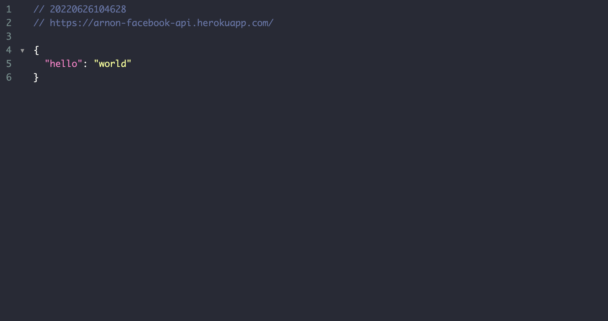

# Facebook API Clone

## Configurações

Crie um arquivo `.env` e defina as variáveis de ambiente conforme o arquivo [`.env.example`](.env.example).

Não esqueça de atribuir os valores de MYSQL e SMTP conforme necessário.

> No meu caso utilizei as seguinte opções gratuitas:
> - **remotemysql.com** como Banco de Dados;
> - **smtp.aol.com** como servidor de SMTP.

Após conectado ao banco de dados, execute o comando para criar as tabelas:

```sh
node ace migration:run
```

## Inicialização

Após configurado execute:

```sh
node ace serve --watch
```

Com isso já deverá ser possível ver o projeto em execução:



Para fazer o build do projeto, execute:

```sh
node ace build --production
```

